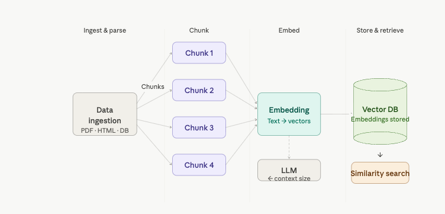

# RAG Pipeline

A Retrieval-Augmented Generation (RAG) pipeline built with LangChain, covering document loading from multiple file formats.



## Features

- Load documents from **text files**, **PDFs**, and **Excel spreadsheets**
- Directory-based batch loading with glob patterns
- LangChain `Document` objects with metadata

## Project Structure

```
Rag-Pipeline/
├── data/
│   ├── pdf/            # PDF documents
│   ├── text_files/     # Plain text documents
│   └── sample.xlsx     # Sample Excel file
├── notebook/
│   └── document.ipynb  # Main notebook
├── main.py
├── pyproject.toml
└── requirements.txt
```

## Setup

```bash
pip install -r requirements.txt
```

Or with `uv`:

```bash
uv sync
```

## Dependencies

| Package | Purpose |
|---|---|
| `langchain-core` | `Document` class |
| `langchain-community` | Document loaders |
| `pymupdf` | PDF loading |
| `unstructured` | Excel loading |
| `openpyxl` | `.xlsx` file parsing |
| `msoffcrypto-tool` | Encrypted Office file support |

## Usage

Open `notebook/document.ipynb` and run the cells to:

1. Create and inspect `Document` objects
2. Load `.txt` files with `TextLoader` / `DirectoryLoader`
3. Load `.pdf` files with `PyMuPDFLoader`
4. Load `.xlsx` files with `UnstructuredExcelLoader`
